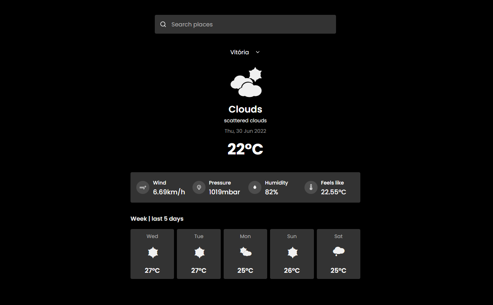

# Weather-app | Api de dados meteorológico [openweathermap](https://openweathermap.org/api)

## Sobre o Projeto

Esse é um aplicativo meteorológico simples que realiza busca e retorna os dados da api.

LINK PARA O SITE : [weather-react-app-beta.vercel.app](https://weather-react-app-beta.vercel.app/)

## Objetivo?

Prática conceitos do react e com TDD e melhorar meu código, além de aprender a utilizar ferramentas como storybook para poder visualizar os componentes de melhor forma.

## Libs Usadas

- MSW
- styled components

## Storybook

    :heavy_check_mark: Storybook [Storybook](https://weather-react-app-stories.vercel.app/)

## Testes Unitários

    :heavy_check_mark: coverage [coverage](https://weather-react-app-coverage.vercel.app/)

## Funcionalidades

- Home

  - :heavy_check_mark: Temperatura atual da cidade
  - :heavy_check_mark: curta descrição do tempo atual
  - :heavy_check_mark: Temperatura dos 5 dias anteriores
  - :heavy_check_mark: medições em tela de pressão, força do vento, umidade e sensação térmica

- Search

  - :heavy_check_mark: Pesquisar por nome da cidade

- Localstorage
  - :heavy_check_mark: Persiste a última pesquisa
  - :heavy_check_mark: Guarda o histórico de pesquisa
  - :heavy_check_mark: Remove do histórico buscas feitas
